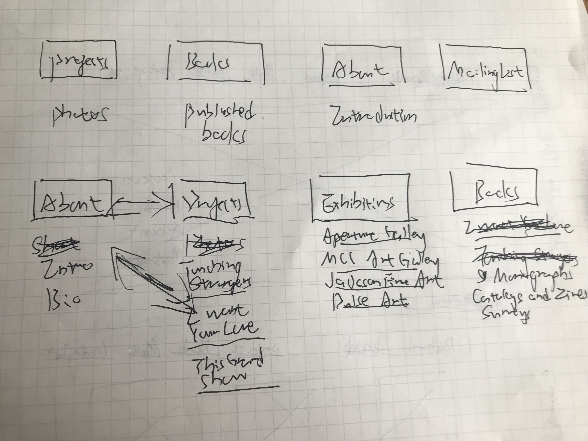
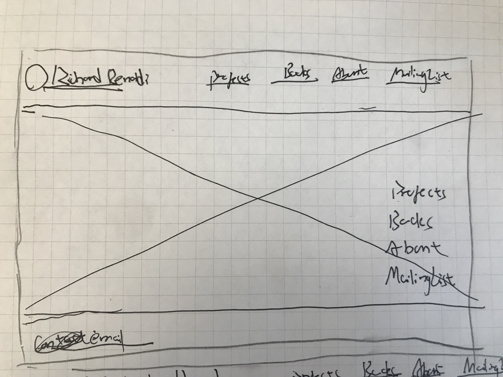
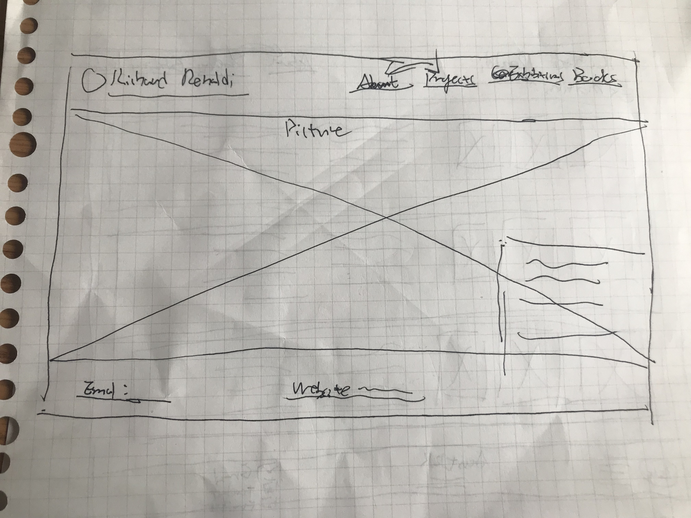
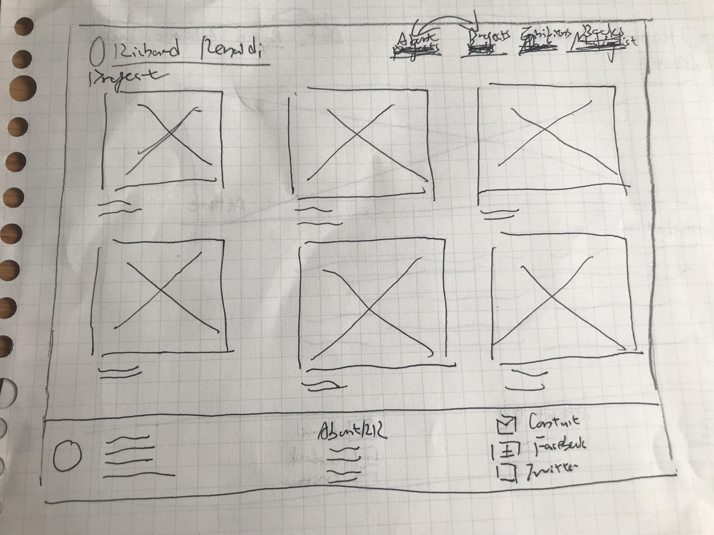
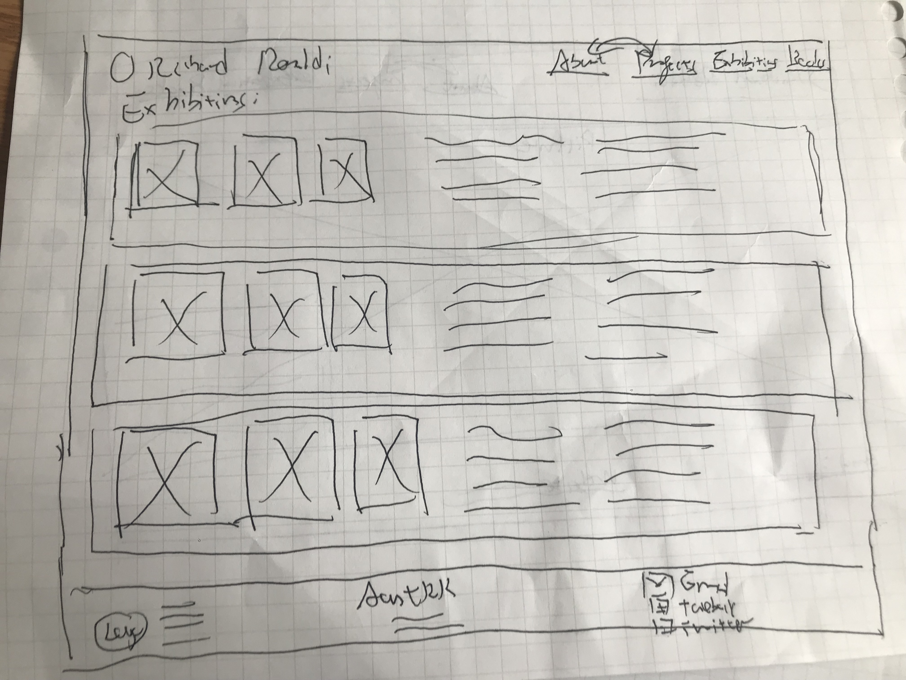
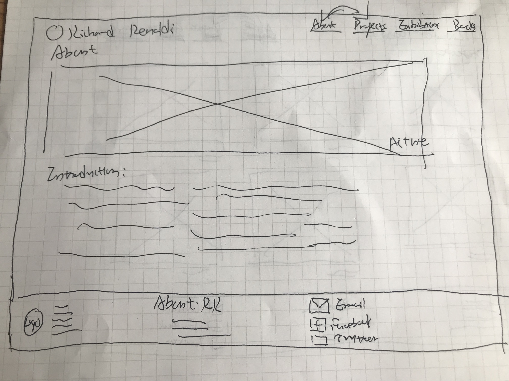
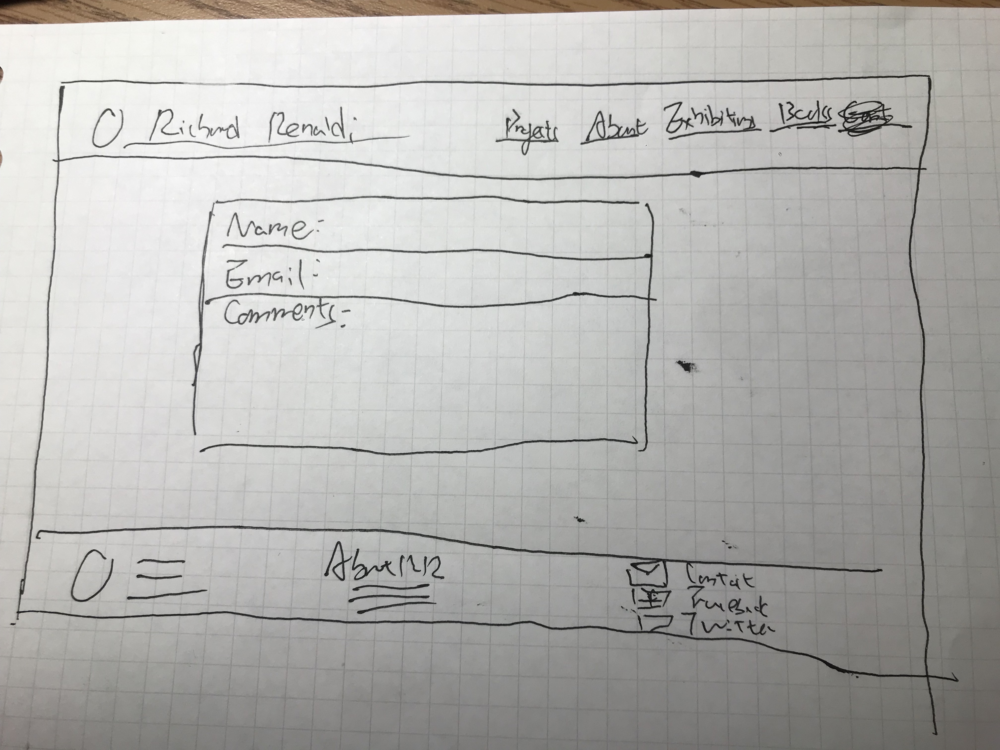
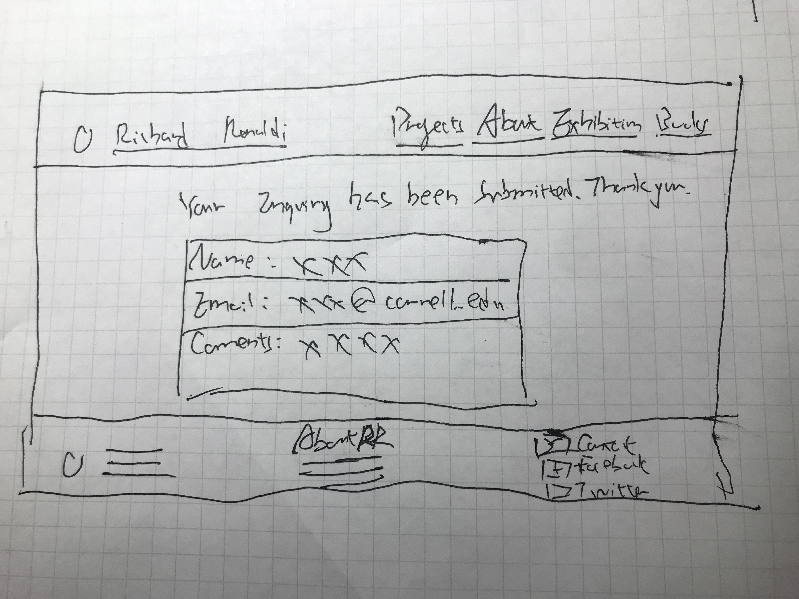

# Project 1: Design Journey

Your Name: [Yuhang Wang]

# Project 1, Milestone 1 - Design & Plan

## Website Topic

I'm designing a website for one of my favourite photographers----Richard Renaldi. This website is built to introduce this photogrpaher and his work to the public.

## Target Audiences

One group of target audience is gallery curators. They search for artists and invite them to exhibit their works in the gallery.
The second group of target audience is photography lovers. They get to know this photographer somewhere and want to see his work, so they go online and check his photographs.

## Design Process

Previously, I placed "about" at the first place of the navigation bar but later I switched it with "projects".Since this is a website to introduce a photographer, it's necessary to put his work at the first place. People usually want to check the work first before they know who the artist is. I also include "exhibition" and "books" because gallery curators want to know what exhibitions this artist held before and what published work he has. Here is the card sorting process:

Here's the first idea of the homepage:

For the homepage, I plan to use a photo of Richard Renaldi as the background. On the top left are his logo and name. I originally thought to place the navigation bar on the lower right corner as the picture shows, but I think it's better to put a short introduction here so people know who he is.

## Final Design Plan

Homepage:
• photo as background
• navigation bar including "Project","About","Exhibitions", "Books"
• contact email
• photographer's website link
• short bio

Project:
• Cover photos of the project
• short intro of the project
• footer

About:
• Picture of the photographer
• Paragraphs of introduction
• footer

Exhibition:
• Several photos of the exhibition
• Short intro of the exhibtion
• footer

Form:
• Name
• Email
• Comment
• Footer

Form:
• Name
• Email
• Comment
• Footer

## Target Audiences' Needs

For gallery curators, they have an idea of what exhibitions the photographer held before and know what kind of work he produced. They also have the access to the photographer through the website link and contact email.
For photograph lovers, they can check all the work Richard Renaldi have done and know books he published. They also get to know the photographer more through the introduction and bio.

## Templates

header.php template
footer.php template

# Project 1, Milestone 2 - Draft Website

## Sticky Form

[What fields are required for your form?]

[Plan out your error messages for your target audiences here.]
Name, emails, and comments.
The error message would assess whether the name field is blank, whether the email is filled in, whether it is a valid email address and whether the comment section is blank.
## Validation Code Plan

[Write out your pseudocode plan for handling the validation of the form.]
When any one of them is blank, a message would show up, saying " please fill in the name/email/comment field. If all of the fields are filled, it will turn to the confirmation page.

# Final Submission: Complete & Polished Website

## Target Audiences

[Tell us how your final site meets the needs of the target audiences. Be specific here. Tell us how you tailored your design, content, etc. to make your website usable by both target audiences.]
For people who are simply interested in photography, they can have a rough view of what the style of this photographer is like and see some of his pictures. For curators, they can see the past exhibitions held by the photographer and see some of his photos so they can decide whether to collaborate with this artist.
## Reflection

[Take this time to reflect on what you learned during this assignment. How have you improved from 1300? What things did you have trouble with?]
I was having some troubles with making things line up since I didn't take 1300 before. With the flexform, it works much better. Also, with templates, it saved a lot of time for me because I don't need to repeat doing the same stuff.
